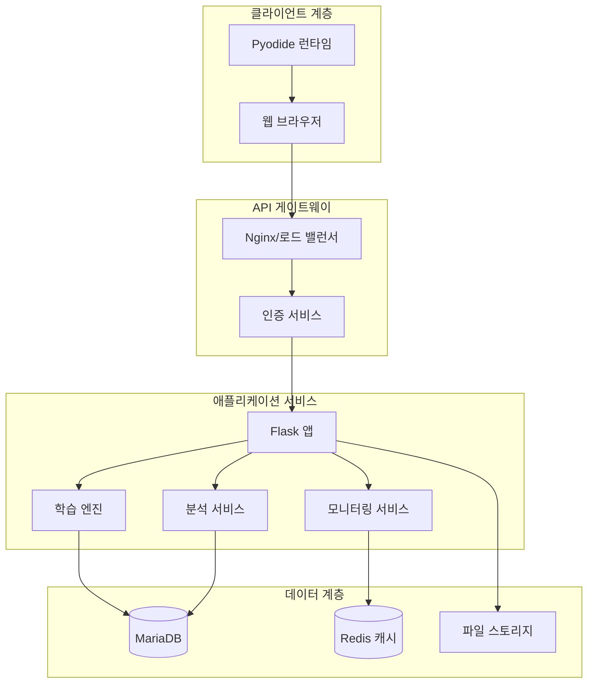

# EduVerse Product Requirements Document (PRD)

## 📋 문서 정보

| 항목 | 내용 |
|------|------|
| 제품명 | EduVerse - LogiCore Tech Learning Platform |
| 버전 | 2.8 |
| 최종 수정일 | 2025-10-19 |
| 상태 | 개발 중 |
| 관련 문서 | 역할별 기능 리스트 v3.7, 시스템 아키텍처 v1.4 |

## 📝 변경 이력

| 버전 | 일자 | 변경 내용 | 작성자 |
|------|------|----------|--------|
| 2.8 | 2025-10-19 | • **기술 스택 통일 및 관리자 기능 확장**<br>&nbsp;&nbsp;- 백엔드 기술 스택: Flask/Gunicorn → Express.js/Node.js + Prisma ORM으로 통일<br>&nbsp;&nbsp;- Redis 캐시 추가 명시 (세션 관리, 실시간 모니터링, Rate Limiting)<br>&nbsp;&nbsp;- 인프라: Python 제거, Node.js 런타임 추가<br>&nbsp;&nbsp;- 관리 로그 기능 추가 (§5.2 관리자 기능)<br>&nbsp;&nbsp;- 시스템 아키텍처 v1.4 반영 | Claude AI |
| 2.7 | 2025-10-19 | • **관리자 기능 추가**: §5.2 플랫폼 기능에 관리자 기능 세션 신규 추가<br>&nbsp;&nbsp;- 전체 사용자 조회/검색/상태 변경/정보 수정/삭제<br>&nbsp;&nbsp;- 전체 수업 조회/상세 조회<br>&nbsp;&nbsp;- 전역 설정 관리<br>&nbsp;&nbsp;- 역할별 기능 리스트 v3.5 반영 | Claude AI |
| 2.6 | 2025-10-17 | 문서 정보 한글화 및 정합성 강화 | Claude AI |
| 2.5 | 2025-10-17 | 용어 통일 (성과 대시보드) | Claude AI |
| 2.0 | 2025-01-14 | Initial PRD version | Claude AI |

---

## 1. 개요

### 1.1 제품 비전
"오프라인 수업 환경에서 프로그래밍을 처음 배우는 학생들이 실무를 경험하며 성장하는 인턴십 시뮬레이션 교육 플랫폼"

### 1.2 제품 미션
**오프라인 교육 현장**에서 프로그래밍을 처음 접하는 학생들에게 가상의 IT 기업 'LogiCore Tech' 인턴십 경험을 제공하여, 교수자의 실시간 지도 아래 실무 맥락 속에서 자연스럽게 프로그래밍 기초를 습득하고 개발자로서의 첫 걸음을 성공적으로 시작할 수 있도록 돕는다.

### 1.3 사용 환경
EduVerse는 **대면(오프라인) 수업 환경**에서 활용되는 플랫폼입니다.

#### 전형적인 사용 시나리오
```
[컴퓨터실 / 강의실]
- 교수자 1명이 앞에서 수업 진행
- 학생 20-100명이 각자의 PC/노트북으로 참여
- 모든 학생이 브라우저를 통해 EduVerse 접속
- 교수자는 실시간으로 학생들의 화면과 진도 모니터링
- 즉각적인 대면 피드백 + 플랫폼 기반 자동 평가
```

#### 오프라인 환경의 장점
1. **즉각적 상호작용**: 교수자가 물리적으로 학생 옆에서 직접 지도 가능
2. **실시간 모니터링**: Code Peek으로 전체 학생 상태를 한눈에 파악
3. **집중도 향상**: 교실 환경에서 학습에만 집중
4. **즉시 질의응답**: 손을 들어 바로 질문하고 답변 받기
5. **동료 학습**: 옆 학생과 협업하거나 서로 도움

---

## 2. 문제 정의

### 2.1 시장 문제점
1. **이론과 실무의 괴리**: 기존 교육은 실제 업무 환경과 동떨어진 이론 중심
2. **개별 학습 관리 어려움**: 교육자가 학습자 개개인의 진도와 이해도 파악 불가
3. **즉각적 피드백 부재**: 질문에 대한 답변 지연, 코드 리뷰 부족
4. **환경 구축 장벽**: 개발 환경 설정에 소요되는 시간과 기술적 장벽
5. **학습 동기 부족**: 단조로운 문제 풀이로 인한 낮은 참여도

### 2.2 타겟 사용자의 Pain Points

#### 학습자 (프로그래밍 입문 학생)
- 프로그래밍이 처음이라 어디서부터 시작해야 할지 막막함
- 문법은 배웠지만 실제로 어떻게 활용하는지 모름
- 혼자 공부하다 막히면 물어볼 곳이 없어 포기
- 취업/인턴을 위해 실무 경험이 필요하지만 기회가 없음

#### 교육자 (대학 교수/강사)
- 수십-수백 명의 학생을 개별 지도하기 어려움
- 학생이 어느 부분에서 막히는지 실시간 파악 불가
- 이론 수업과 실습의 연결이 어려움
- 학생들의 학습 동기 부여가 힘듦

#### 교육기관 (대학/학원)
- 실무와 동떨어진 커리큘럼으로 학생 만족도 저하
- 실습 환경 구축 및 유지보수 비용 부담
- 교육 성과 측정의 어려움
- 취업률 향상 압박

---

## 3. 제품 개요

### 3.1 핵심 가치 제안
EduVerse는 **오프라인 교실 환경**에서 **프로그래밍을 처음 배우는 학생**이 가상의 IT 기업 'LogiCore Tech'의
**인턴십 프로그램**에 참여하는 설정으로, 실제 회사의 팀장, 선임 개발자, 멘토와 함께 단계별 프로젝트를 수행하며
**프로그래밍 기초부터 실무 스킬까지** 자연스럽게 습득하는 **대면 수업 특화 인턴십 시뮬레이션 교육 플랫폼**입니다.

#### 오프라인 수업 최적화
- 💻 **제로 셋업**: 브라우저만 있으면 즉시 시작, 복잡한 개발환경 설치 불필요
- 👁️ **실시간 모니터링**: 교수자가 강의실에서 모든 학생의 진도와 코드를 실시간 확인
- 🎯 **즉각적 개입**: 어려움을 겪는 학생을 즉시 파악하고 직접 도움
- 📊 **수업 후 분석**: 수업이 끝난 후 전체 학생의 학습 패턴 분석 및 개선

### 3.2 차별화 요소 (오프라인 수업 특화)
1. **🏫 대면 수업 최적화**: 오프라인 교실 환경에서 최고의 효율을 발휘하도록 설계
2. **🎮 스토리텔링 기반 학습**: 게임처럼 몰입되는 시나리오형 커리큘럼
3. **👁️ 실시간 교실 모니터링**: 교수자가 강의실에서 모든 학생의 화면을 실시간 확인 (Code Peek)
4. **💬 즉각적 대면 + 온라인 상호작용**: 손들어 질문 + 플랫폼 Q&A + AI 튜터 삼중 지원
5. **🌐 제로 셋업 & 다중 언어**: 브라우저만으로 Python, JavaScript, C, Java 즉시 실행
6. **📊 수업 후 심층 분석**: 교수자가 수업 종료 후 학생별 학습 패턴 분석 및 개선점 도출
7. **⚡ 전문가급 에디터**: Monaco Editor 기반 구문 강조, 자동완성, IntelliSense

### 3.3 제품 아키텍처

```
┌─────────────────────────────────────────────┐
│           사용자 인터페이스 계층              │
│   ┌─────────┬──────────┬──────────────┐    │
│   │  학생   │   교수   │    관리자      │    │
│   │   앱    │ 대시보드 │   대시보드     │    │
│   └─────────┴──────────┴──────────────┘    │
├─────────────────────────────────────────────┤
│          애플리케이션 서비스 계층             │
│   ┌─────────┬──────────┬──────────────┐    │
│   │ 학습    │ 모니터링 │    분석       │    │
│   │ 엔진    │ 서비스   │   서비스      │    │
│   └─────────┴──────────┴──────────────┘    │
├─────────────────────────────────────────────┤
│              데이터 계층                      │
│   ┌─────────┬──────────┬──────────────┐    │
│   │MariaDB  │Redis(옵션)│ File Storage │    │
│   │   DB    │  캐시    │   (코드)      │    │
│   └─────────┴──────────┴──────────────┘    │
├─────────────────────────────────────────────┤
│           인프라스트럭처 계층                │
│   ┌─────────────────────────────────────┐   │
│   │   Cafe24 클라우드 가상서버           │   │
│   └─────────────────────────────────────┘   │
└─────────────────────────────────────────────┘
```

---

## 4. 사용자 페르소나 및 사용자 스토리

### 4.1 주요 페르소나

#### 🧑‍💻 Persona 1: 김민준 (프로그래밍 입문 학생)
- **배경**: 대학 1-2학년, 프로그래밍 경험 전무, IT 분야 관심
- **목표**: 프로그래밍 기초 습득, 인턴/취업 준비, 개발자 커리어 탐색
- **과제**: 프로그래밍이 너무 어렵고 추상적, 어디서부터 시작할지 막막, 실습 기회 부족
- **니즈**: 쉽고 재미있는 학습, 실무 맥락 이해, 단계별 가이드, 즉각적 피드백
- **시나리오 내 역할**: LogiCore Tech 인턴 (가상)

#### 👩‍🏫 Persona 2: 박교수 (대학 교수)
- **배경**: 컴퓨터공학과 교수, 프로그래밍 기초 과목 담당 (주 2회 오프라인 강의)
- **목표**: 강의실 수업의 효과성 극대화, 학생들의 프로그래밍 기초 역량 향상
- **과제**: 100명+ 대규모 강의실, 개별 실습 지도 불가, 누가 막히는지 파악 어려움
- **니즈**:
  - 강의 중 학생 화면 실시간 모니터링
  - 어려움을 겪는 학생 즉시 파악
  - 자동화된 실습 평가
  - 수업 후 학습 데이터 분석
- **오프라인 수업 환경**: 컴퓨터실에서 주 2회 2시간씩 진행

### 4.2 사용자 스토리

#### 학습자 스토리
```
AS A 프로그래밍을 처음 배우는 학생
I WANT TO 게임처럼 재미있는 인턴십 시나리오로 코딩을 배우고
SO THAT 어려운 프로그래밍도 포기하지 않고 끝까지 학습할 수 있다

AS A 프로그래밍 입문자
I WANT TO 브라우저에서 바로 코드를 실행하고 결과를 볼 수 있어
SO THAT 복잡한 설치 과정 없이 프로그래밍의 첫 걸음을 시작할 수 있다

AS A 초보 학습자
I WANT TO 막힐 때 가상의 선배(Alex, Sena)에게 즉시 도움을 받고
SO THAT 혼자 공부하다 포기하지 않고 계속 진행할 수 있다

AS A 프로그래밍 초보
I WANT TO 내 코드가 맞는지 게임처럼 즉시 확인하고
SO THAT 틀려도 재미있게 다시 도전할 수 있다

AS A 프로그래밍 입문 학생
I WANT TO 실수해도 안전한 가상 환경에서 자유롭게 실험하고
SO THAT 실패에 대한 두려움 없이 코딩을 탐험할 수 있다
```

#### 교수자 스토리
```
AS A 교육자
I WANT TO 학생들의 실시간 진도를 한눈에 보고
SO THAT 도움이 필요한 학생을 즉시 파악할 수 있다

AS A 교육자
I WANT TO 학습 데이터를 분석하여
SO THAT 커리큘럼을 지속적으로 개선할 수 있다
```

---

## 5. 기능 요구사항

### 5.1 커리큘럼 구조

#### 커리큘럼 개요
EduVerse는 **커리큘럼 기반 학습 시스템**을 채택하여, 관리자가 설계한 완성된 시나리오 패키지를 교수자가 선택하여 수업에 활용합니다.

#### 커리큘럼 속성
| 속성 | 설명 | 예시 |
|------|------|------|
| **이름** | 커리큘럼 제목 | "C 프로그래밍 기초" |
| **설명** | 커리큘럼 소개 및 학습 목표 | "C언어의 기본 문법부터 포인터까지..." |
| **주차 수** | 전체 학습 기간 | 12주 |
| **주차별 시나리오** | 각 주차의 스토리, 미션, 과제 | Week 1: 변수와 출력, Week 2: 조건문... |
| **데이터 소스** | 코드 템플릿, 테스트 케이스, 학습 자료 | starter_code.c, test_cases.json |

#### MVP 제공 커리큘럼 (4개)
1. **C 프로그래밍 기초** - C언어 기본 문법 및 포인터
2. **Java 프로그래밍 기초** - Java 객체지향 프로그래밍 입문
3. **JavaScript 프로그래밍 기초** - 웹 개발을 위한 JavaScript 기초
4. **C# 프로그래밍 기초** - C# 언어 기본 및 .NET 환경

#### 커리큘럼 관리 정책
- **관리자 권한**: 커리큘럼 생성/수정은 관리자만 가능 (MVP 범위 밖)
- **교수자 권한**: 사전 등록된 커리큘럼 중 1개 선택, 내부 구조 수정 불가
- **블랙박스 구조**: 교수자는 커리큘럼을 하나의 완성된 패키지로 사용
- **시나리오 기반**: 예)LogiCore Tech 인턴십 형식의 스토리텔링 학습

---

### 5.2 핵심 기능

#### 학습 경험

| 기능 | 설명 | 우선순위 | 상태 |
|---------|-------------|----------|--------|
| 인턴십 시뮬레이션 | LogiCore Tech 가상 인턴 프로그램 (교수자 설정 기간) | P0 | 🔄 준비중 |
| 다중 언어 지원 | Python, JavaScript, C, Java 브라우저 내 실행 | P0 | 🔄 준비중 |
| Monaco Editor | VS Code 급 전문 에디터 (구문 강조, 자동완성, IntelliSense) | P0 | 🔄 준비중 |
| 가상 멘토 시스템 | Alex(친근한 팀장), Sena(도움 주는 선임), 김교수(전문가) | P0 | 🔄 준비중 |
| 게임형 평가 시스템 | 미션 완료 방식, 재도전 가능 | P0 | 🔄 준비중 |
| 힌트(강의보기) | 교수의 요약 강의 수강 및 문제 해결 도움말 확인 | P0 | 🔄 준비중 |
| 제출 데이터 수정 불가 | 제출한 퀴즈/설문 결과는 수정 불가, 재도전 시에도 첫 번째 제출 결과 유지 | P0 | 🔄 준비중 |
| 진도 자동 저장 | 언제든 이어서 학습 가능(주차별 수업이 종료되기 전에만 가능) | P0 | 🔄 준비중 |
| 수업 탈퇴 | 비밀번호 검증 후 수업 탈퇴 가능, 학습 데이터는 Soft Delete로 보존 | P0 | 🔄 준비중 |
| 수업 재참여 | 탈퇴한 수업에 재참여 시 이전 학습 데이터 연결(조회 가능) | P0 | 🔄 준비중 |

##### 제출 데이터 정책 (학습 무결성 보장)

**기본 원칙**
- 학생이 주차별 수업에서 한 번 제출한 데이터는 **수정할 수 없음**
- 재도전은 가능하지만, **첫 번째 제출 결과가 최종 평가에 사용됨**
- 이 정책은 학습 데이터의 무결성과 평가의 공정성을 보장

**적용 대상**
- ✅ 퀴즈/테스트 결과
- ✅ 설문 응답
- ✅ 코드 제출 결과 (첫 번째 제출 시점 기준)
- ✅ 업무일지 (주차별 자기평가)

**재도전 정책**
- 학생은 자유롭게 재도전 가능 (횟수 제한 없음)
- 재도전 시 실시간 피드백 제공 (학습 목적)
- 단, 교수자 대시보드 및 성적 산출에는 **첫 번째 제출 결과만 반영**
- 재도전 이력은 참고용으로 기록

**UI/UX 설계**
- 첫 번째 제출 후 "이미 제출되었습니다. 재도전은 가능하지만 평가에는 첫 번째 결과가 사용됩니다." 안내
- 재도전 버튼: "다시 도전하기 (연습용)"
- 첫 번째 제출 결과 강조 표시: "✅ 최종 제출: 80점 (2025-10-17 14:30)"

**기술 구현**
```sql
-- submissions 테이블
CREATE TABLE submissions (
  id INT PRIMARY KEY AUTO_INCREMENT,
  student_id INT NOT NULL,
  task_id INT NOT NULL,
  week_number INT NOT NULL,
  submission_number INT NOT NULL, -- 1, 2, 3...
  is_first_submission BOOLEAN DEFAULT FALSE, -- 첫 번째 제출 플래그
  score INT,
  submitted_at TIMESTAMP,
  -- 첫 번째 제출만 is_first_submission = TRUE
  CONSTRAINT unique_first_submission UNIQUE (student_id, task_id, is_first_submission)
);
```

#### 교수자 도구

##### 수업 생성 및 관리
| 기능 | 설명 | 우선순위 | 상태 |
|---------|-------------|----------|--------|
| 커리큘럼 선택 | 4개 사전 등록 커리큘럼 중 1개 선택 | P0 | 🔄 준비중 |
| 수업 생성 | 수업명(자동+수정), 학년/학기 입력 | P0 | 🔄 준비중 |
| 입장 코드 생성 | 영어 대문자+숫자 6자리 자동 생성 | P0 | 🔄 준비중 |
| QR 코드 생성 | 3D QR 코드 자동 생성 | P0 | 🔄 준비중 |
| 수업 수정 | 수업명, 설명, 교수자명 수정 | P0 | 🔄 준비중 |
| 수업 삭제 | 보안 검증 후 Soft Delete (Hiding 처리) | P0 | 🔄 준비중 |
| 주차별 수업 시작/종료 | UI 버튼으로 주차별 수업 상태 전환, 24시간 후 자동 종료, **동시 진행 제한(1개 주차만 가능)**, **순차 진행 불필요(1주차 건너뛰고 2주차 시작 가능)** | P0 | 🔄 준비중 |

##### 모니터링 및 상호작용
| 기능 | 설명 | 우선순위 | 상태 |
|---------|-------------|----------|--------|
| 실시간 모니터링 대시보드 | 학생별 진도/상태 실시간 확인 | P0 | 🔄 준비중 |
| 코드 피크 | 학생 코드 실시간 보기 | P0 | 🔄 준비중 |
| 실시간 Q&A | 즉각적 답변 및 알림 | P0 | 🔄 준비중 |
| 학습 분석 리포트 | 성과, 패턴, 개선점 분석 | P0 | 🔄 준비중 |

#### 플랫폼 기능
| 기능 | 설명 | 우선순위 | 상태 |
|---------|-------------|----------|--------|
| 사용자 인증 | 이메일 기반 회원가입(인증번호 방식), 로그인, 역할 구분 | P0 | 🔄 준비중 |
| 이메일 인증 | 숫자 6자리 인증번호 발송 및 검증 (유효시간 10분) | P0 | 🔄 준비중 |
| 수업 초대 시스템 | 6자리 초대 코드 | P0 | 🔄 준비중 |
| 업무일지 | 주차별 자기평가 및 피드백 | P0 | 🔄 준비중 |
| 성과 대시보드 | 개인 학습 통계 확인 | P0 | 🔄 준비중 |
| 모바일 반응형 | 태블릿/모바일 지원 | P0 | 🔄 준비중 |

#### 관리자 기능
| 기능 | 설명 | 우선순위 | 상태 |
|---------|-------------|----------|--------|
| 전체 사용자 조회 | 모든 사용자 리스트 조회 및 검색 (이메일/이름) | P0 | 🔄 준비중 |
| 사용자 상태 변경 | 사용자 활성/비활성/정지 상태 관리 | P0 | 🔄 준비중 |
| 사용자 정보 수정 | 이름, 이메일, 역할 수정 | P0 | 🔄 준비중 |
| 사용자 삭제 | 사용자 계정 영구 삭제 | P0 | 🔄 준비중 |
| 전체 수업 조회 | 모든 수업 리스트 및 상세 정보 확인 | P0 | 🔄 준비중 |
| 전역 설정 | 시스템 전체 설정 관리 | P0 | 🔄 준비중 |
| 관리 로그 조회 | 모든 관리자 활동 추적 및 조회 | P0 | 🔄 준비중 |

### 5.2 Non-Functional Requirements

#### 성능 (Performance)
- 페이지 로드 시간: < 2초
- API 응답 시간: < 200ms (p95)
- 동시 접속자: 1,000명 이상
- 코드 실행 결과 출력: < 1초

#### 보안 (Security) 🔴 **긴급 개선 필요**
- [ ] 비밀번호 해싱 (현재 평문 저장)
- [ ] 이메일 인증 시스템 (숫자 6자리 인증번호, 유효시간 10분)
- [ ] XSS 방어 (입력 새니타이제이션)
- [ ] API 인증/인가 (세션 기반)
- [ ] HTTPS 강제
- [ ] Rate Limiting (인증번호 재전송 30초 쿨다운)

#### 확장성 (Scalability)
- 수평 확장 가능 아키텍처
- 마이크로서비스 전환 준비
- 글로벌 CDN 지원

#### 사용성 (Usability)
- 온보딩 완료: < 5분
- 첫 코드 실행: < 10분
- 모든 기능 3클릭 이내 접근

---

## 6. 기술 사양

> ⚠️ **중요 안내**: 아래 기술 스택과 아키텍처는 현재 목업 단계의 구성입니다. 실제 개발 과정에서 성능, 비용, 확장성을 고려하여 변경될 수 있습니다.

### 6.1 기술 스택

#### 프론트엔드
- **핵심**: React, TypeScript
- **스타일링**: Tailwind CSS
- **코드 에디터**: Monaco Editor
- **실행 환경**:
  - Python: Pyodide (WebAssembly)
  - JavaScript: 브라우저 네이티브 실행
  - C/Java: Piston API (https://emkc.org/api/v2/piston)
- **차트**: Chart.js
- **아이콘**: Lucide

#### 백엔드
- **프레임워크**: Express.js (Node.js)
- **서버**: Node.js Runtime
- **데이터베이스**: Cafe24 MariaDB
- **ORM**: Prisma
- **캐시**: Redis (세션 관리, 실시간 모니터링, Rate Limiting)
- **인증**: 자체 구현 (개선 필요)

#### 인프라
- **플랫폼**: Cafe24 클라우드 가상서버
  - Node.js Runtime
  - MariaDB
  - Redis (선택사항)
- **컨테이너**: Docker 지원
- **CI/CD**: GitHub Actions (미정)

### 6.2 시스템 아키텍처



---

## 7. 사용자 인터페이스 디자인

### 7.1 디자인 원칙
1. **친근함**: 게임 UI처럼 부담없고 재미있는 디자인
2. **단순함**: 프로그래밍 초보도 쉽게 이해할 수 있는 인터페이스
3. **격려**: 실패해도 다시 도전하고 싶도록 긍정적 피드백
4. **안내**: 다음에 무엇을 해야 할지 항상 명확한 가이드
5. **성취감**: 작은 성공도 크게 축하하는 보상 시스템

### 7.2 주요 화면

#### 학습자 화면 (프로그래밍 입문자 최적화)
1. **환영 화면**: "LogiCore Tech에 오신 것을 환영합니다!" 인턴십 시작
2. **오늘의 미션**: 게임 퀘스트처럼 표시되는 학습 목표
3. **코딩 공간**: 초보자도 겁먹지 않는 친근한 에디터
4. **멘토 대화창**: Alex, Sena가 옆에서 도와주는 느낌
5. **성장 일지**: "오늘 나는 이것을 배웠다!" 자신감 기록

#### 교수자 화면
1. **모니터링 대시보드**: 실시간 학생 상태
2. **Code Peek**: 학생 코드 실시간 보기
3. **Q&A 관리**: 질문 목록 및 답변
4. **분석 리포트**: 차트 기반 성과 분석
5. **수업 관리**: 학생 목록 및 초대

### 7.3 Responsive Design

#### 브레이크포인트 (TailwindCSS 기준)

| 브레이크포인트 | Min Width | TailwindCSS Class |
|---------------|-----------|-------------------|
| Mobile (sm) | 640px | sm: |
| Tablet (md) | 768px | md: |
| Desktop (lg) | 1024px | lg: |
| Large Desktop (xl) | 1280px | xl: |
| Extra Large (2xl) | 1536px | 2xl: |

#### 화면별 레이아웃
- **Mobile (< 768px)**: 단일 컬럼, 탭 네비게이션, padding 16px
- **Tablet (768px ~ 1024px)**: 2단 또는 탭 전환
- **Desktop (≥ 1024px)**: 최적화된 3단 레이아웃

---

## 8. 개발 로드맵

> 📌 **개발 범위 안내**: 아래 로드맵은 현재 예상되는 개발 계획입니다. 실제 개발 과정에서 다음 요인들에 따라 범위와 우선순위가 조정될 수 있습니다:
> - **사용자 피드백**: 초기 사용자들의 요구사항과 피드백
> - **시장 상황**: 경쟁사 동향 및 시장 수요 변화
> - **기술적 제약**: 구현 과정에서 발견되는 기술적 한계
> - **자원 가용성**: 팀 규모, 예산, 일정의 변화
> - **규제 요구사항**: 교육 관련 법규 및 보안 규정 변경

### 8.1 현재 상태 (목업)
- 🔄 핵심 학습 기능 준비중
- 🔄 12주 커리큘럼 콘텐츠 준비중
- 🔄 기본 모니터링 기능 준비중
- ⚠️ 보안 취약점 존재
- ⚠️ 성능 최적화 필요

### 8.2 1단계: 보안 및 안정성 (MVP)
- [ ] 비밀번호 해싱 구현
- [ ] XSS 방어 적용
- [ ] API 인증 강화
- [ ] 입문자용 온보딩 개선 (5분 내 첫 코드 실행)
- [ ] 에러 메시지 초보자 친화적으로 개선
- [ ] 모바일 지원 (태블릿 우선)
- [ ] 다중 언어 지원 (Python, JavaScript, C, Java + Monaco Editor)

### 8.3 2단계: 기능 강화
- [ ] 초보자용 AI 튜터 강화 (더 친절한 설명)
- [ ] 시각적 코드 실행 과정 표시
- [ ] 마켓플레이스 등록

### 8.4 개발 우선순위 조정 원칙

#### 필수 기능 (Must Have)
- 핵심 학습 기능 (코드 편집, 실행, 평가)
- 기본 보안 (인증, 데이터 보호)
- 교수자 모니터링 대시보드

#### 중요 기능 (Should Have)
- 게임화 요소
- 상세 분석 리포트
- 모바일 지원

#### 선택 기능 (Nice to Have)
- AI 튜터 고도화
- 다국어 지원
- 소셜 기능

---

## 9. 개발 방법론 및 스프린트 운영

### 9.1 애자일 개발 방법론

EduVerse 프로젝트는 **애자일(Agile) 개발 방법론**을 채택하여 빠른 반복 개발과 지속적인 개선을 추구합니다.

### 9.2 스프린트 운영

#### 스프린트 주기
- **주기**: 1주 (Weekly Sprint)
- **시작**: 매주 월요일 오전 10시 30분 (Sprint Planning Meeting)
- **종료**: 매주 금요일 오후 1시 (Sprint Review & Retrospective)

#### 스프린트 미팅 구조

| 미팅 | 일시 | 시간 | 참석자 | 목적 |
|------|------|------|--------|------|
| **Sprint Planning** | 월요일 10:30 | 1시간 | 전체 팀 | 이번 주 목표 설정, 태스크 분배, 우선순위 결정 |
| **Daily Standup** | 화-금 10:00 | 15분 | 전체 팀 | 진행 상황 공유, 장애물 파악 |
| **Sprint Review** | 금요일 13:00 | 30분 | 전체 팀 | 완료된 작업 데모, 피드백 수집 |
| **Sprint Retrospective** | 금요일 13:30 | 30분 | 전체 팀 | 개선점 논의, 다음 스프린트 계획 |

#### 스프린트 산출물
- **Sprint Backlog**: 이번 주 수행할 작업 목록
- **Burndown Chart**: 일일 진행 상황 추적
- **Demo**: 금요일 완료된 기능 시연
- **Retrospective Notes**: 개선 사항 및 액션 아이템

#### 작업 우선순위 결정 기준
1. 사용자 피드백 반영도
2. 비즈니스 가치
3. 기술적 의존성
4. 긴급도 (보안, 버그 수정 등)

> 💡 **지속적 개선**: 주간 단위 스프린트를 통해 빠르게 피드백을 수집하고 우선순위를 재평가하여, 사용자 중심의 제품 개발을 실현합니다.

---

## 10. 문서 변경 이력

| 버전 | 일자 | 변경 내용 | 작성자 |
|------|------|----------|--------|
| 2.6 | 2025-10-17 | • **문서 정합성 강화**: 아키텍처 및 역할별 기능 리스트와의 일치성 향상<br>&nbsp;&nbsp;- 주차별 수업: "순차 진행 불필요" 정책 명시 추가<br>&nbsp;&nbsp;- 아키텍처 다이어그램: ElasticSearch 제거, Redis "(옵션)" 표기, File Storage 추가 | Product Team |
| 2.5 | 2025-10-17 | • **용어 통일**: 역할별 기능 리스트와 용어 일치성 향상<br>&nbsp;&nbsp;- "성장 기록" → "성과 대시보드"로 변경<br>&nbsp;&nbsp;- 기능 설명: "개인 학습 데이터 시각화" → "개인 학습 통계 확인"으로 통일 | Product Team |
| 2.4 | 2025-10-17 | • **기능 정합성 개선**: 역할별 기능 리스트와 일치성 향상<br>&nbsp;&nbsp;- 학습 경험 테이블에 "힌트(강의보기)" 기능 추가 (P0)<br>&nbsp;&nbsp;- 주차별 수업 시작/종료에 "동시 진행 제한(1개 주차만 가능)" 정책 명시 | Product Team |
| 2.3 | 2025-10-17 | • **프로젝트 상태 초기화**: 모든 "구현됨" 상태를 "준비중"으로 변경하여 개발 시작 전 상태 반영 | Product Team |
| 2.2 | 2025-10-17 | • **개발 로드맵 정리**: 게임화 요소(배지, 레벨업) 삭제, 자동 답변 기능 삭제로 범위 명확화 | Product Team |
| 2.1 | 2025-10-17 | • **학생 수업 탈퇴 및 재참여 기능 추가**:<br>&nbsp;&nbsp;- 수업 탈퇴: 비밀번호 검증 후 탈퇴 가능, Soft Delete로 학습 데이터 보존<br>&nbsp;&nbsp;- 수업 재참여: 탈퇴한 수업에 재참여 시 이전 학습 데이터 자동 복구<br>&nbsp;&nbsp;- 우선순위: P0 (MVP 필수 기능)<br>&nbsp;&nbsp;- 상태: 준비중 | Product Team |
| 2.0 | 2025-10-16 | • 오프라인 수업 환경 특화 내용 강화<br>• 교수자 모니터링 기능 상세화<br>• 스프린트 운영 체계 추가<br>• 기술 스택 및 아키텍처 업데이트 | Product Team |
| 1.0 | 2025-10-15 | 초기 문서 작성 | Product Team |

---

*이 문서는 지속적으로 업데이트되며, 실제 개발 과정에서 기능과 우선순위가 조정될 수 있습니다.*

**관련 문서**:
- [역할별 기능 리스트](./02-eduverse-role-based-feature-list.md)
- [프로젝트 수행계획서](../eduverse_프로젝트_수행계획서.md)
