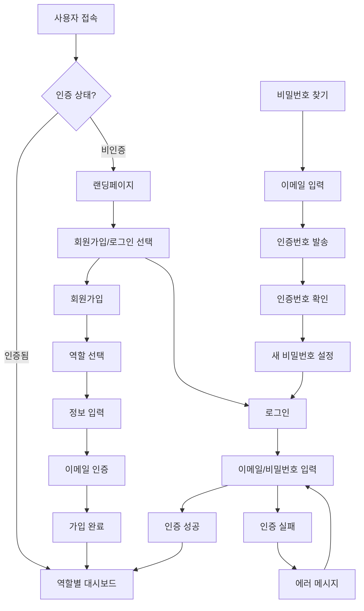
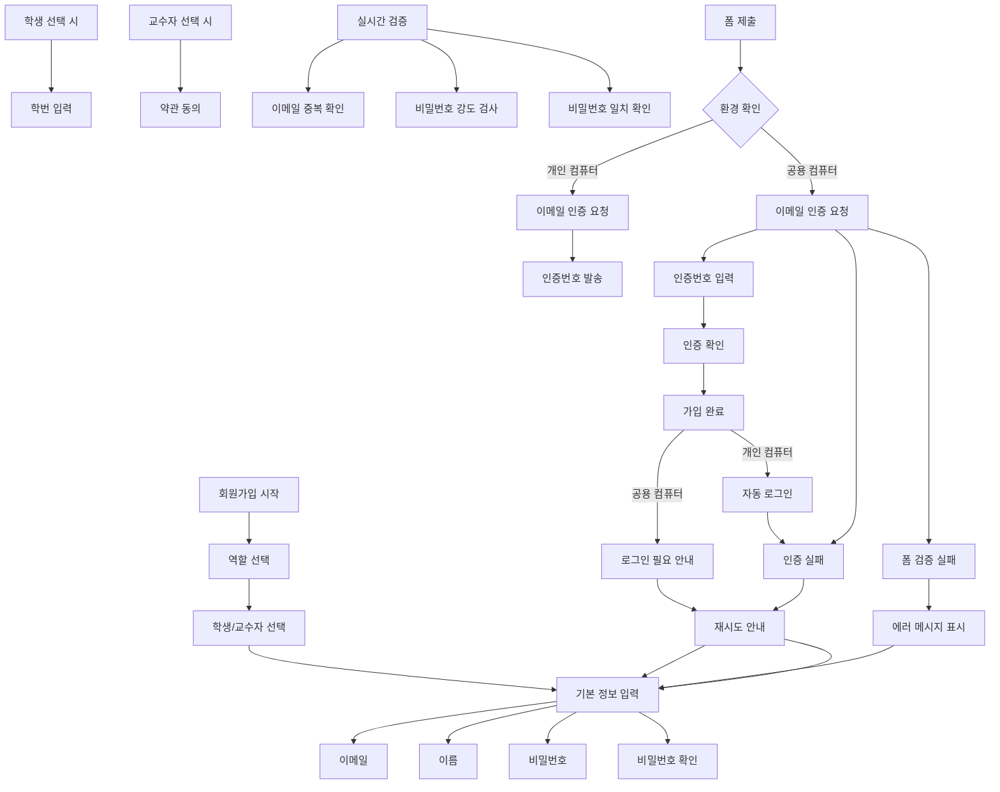

# EduVerse 인증 정책 및 시나리오

## 📋 문서 정보

| 항목 | 내용 |
|------|------|
| 문서명 | EduVerse 인증 정책 및 시나리오 |
| 버전 | 1.0 |
| 최종 수정일 | 2025-10-28 |
| 상태 | 최종 초안 |
| 관련 문서 | 기능 명세서 Part 1: 개요 및 인증, UI 와이어프레임, 프론트엔드 코드 |

---

## 📖 목차

1. [개요](#1-개요)
2. [회원가입 정책](#2-회원가입-정책)
3. [로그인 정책](#3-로그인-정책)
4. [이메일 인증 정책](#4-이메일-인증-정책)
5. [비밀번호 찾기/재설정 정책](#5-비밀번호-찾기재설정-정책)
6. [보안 정책](#6-보안-정책)
7. [인증 플로우 다이어그램](#7-인증-플로우-다이어그램)
8. [시나리오별 상세 흐름](#8-시나리오별-상세-흐름)

---

## 1. 개요

EduVerse 플랫폼의 인증 시스템은 학생, 교수자, 관리자 세 가지 역할을 지원하며, 오프라인 수업 환경에 최적화된 사용자 경험을 제공하는 것을 목표로 합니다.

### 1.1 지원하는 인증 방식
- **이메일 + 비밀번호**: 기본 인증 방식
- **QR 코드**: 학생의 수업 참여용 (초대 코드 기반)
- **이메일 인증**: 계정 활성화 및 비밀번호 재설정

### 1.2 역할별 특징
- **학생**: 초대 코드로 수업 참여(회원가입/로그인 필수), 학습 진행 및 과제 제출
- **교수자**: 수업 생성 및 관리, 학생 모니터링 및 피드백
- **관리자**: 시스템 전체 관리, 사용자 및 커리큘럼 관리

### 1.3 페이지 구조 및 진입 방식
- **공통 랜딩페이지**: 모든 사용자의 첫 화면 (예시-`www.eduverse.co.kr/`)
- **통합 로그인**: 역할 선택 없이 단일 로그인 폼 제공(관리자, 교수, 학생)
- **백엔드 역할 분기**: 입력된 이메일을 기반으로 서버에서 역할 자동 판별
- **분리형 회원가입**: 교수자와 학생을 위한 별도의 회원가입 페이지 제공
- **MVP에서의 회원가입**: 교수는 사전 등록, 학생은 본인 회원가입


### 1.4 도메인별 페이지 경로
- **기본 도메인**: `www.eduverse.co.kr`
  - 랜딩페이지: `www.eduverse.co.kr/` (모든 사용자의 첫 화면)
  - 로그인 페이지: `www.eduverse.co.kr/login` (랜딩페이지에서 접근)
  - 관리자 로그인: `www.eduverse.co.kr/login` (로그인페이지는 단일)
- **회원가입 페이지**:
  - 학생 회원가입: `www.eduverse.co.kr/student/signup`
  - 교수자 회원가입: `www.eduverse.co.kr/professor/signup` (MVP 이후 개발)
- **기타 페이지**:
  - 비밀번호 찾기: `www.eduverse.co.kr/reset-password`
  - 이메일 인증: `www.eduverse.co.kr/verify-email`

---

## 2. 회원가입 정책

### 2.1 기본 정책

| 항목 | 정책 내용 |
|------|----------|
| **가입 대상** | 학생 (교수자는 관리자가 사전 생성) |
| **가입 방식** | 이메일 가입 (MVP), 추후 소셜 로그인 추가 예정 |
| **승인 방식** | 즉시 가입 (MVP), 추후 교수자 승인 제도 도입 가능 |
| **페이지 구조** | 공통 랜딩페이지, 통합 로그인, 학생 전용 회원가입 |
| **진입 방식** | 모든 사용자는 랜딩페이지에서 시작, 역할은 백엔드에서 자동 분기 |
| **교수자 계정** | 관리자가 사전 생성 후 오프라인으로 교수에게 전달 |
| **회원가입 제한** | 동일 IP에서 1분에 5회 가입 시도 제한 |
| **이메일 인증** | 6자리 코드, 10분 유효, 30초 재전송 간격 |
| **환경 기반 처리** | 개인/공용 컴퓨터 환경에 따른 다른 로직 적용 |

### 2.2 로그인 페이지 구조

#### 2.2.1 통합 로그인 페이지
- **URL**: `/login`
- **전체 경로**: `www.eduverse.co.kr/login`
- **페이지 제목**: "EduVerse 로그인"
- **특징**: 역할 선택 없이 단일 로그인 폼 제공
- **백엔드 처리**: 입력된 이메일을 기반으로 역할 자동 판별
- **회원가입 링크**: 하단에 "회원가입"만 표시 (교수자는 관리자 생성)

### 2.3 학생 회원가입 페이지 구조

#### 2.3.1 학생 회원가입 페이지
- **URL**: `/student/signup`
- **전체 경로**: `www.eduverse.co.kr/student/signup`
- **페이지 제목**: "학생 회원가입"
- **헤더 설명**: "초대코드를 받으셨나요? 5분 만에 시작하세요"
- **페이지 설명**: "EduVerse에서 온라인 프로그래밍 수업에 참여하고 학습 진행 상황을 확인하세요"
- **특징**: 학생에 맞춘 UI와 안내 메시지
- **진입점**: 로그인 페이지 하단의 "회원가입" 링크

### 2.4 교수자 계정 관리 정책

#### 2.4.1 교수자 계정 생성
- **생성 주체**: 관리자만 교수자 계정 생성 가능
- **생성 방식**: 관리자 대시보드에서 교수자 정보 직접 입력
- **전달 방식**: 생성된 계정 정보를 오프라인으로 교수에게 전달
- **초기 비밀번호**: 관리자가 설정하며, 교수는 첫 로그인 시 변경 권장

#### 2.4.2 교수자 비밀번호 변경
- **변경 위치**: 설정 → 프로필 메뉴
- **변경 권한**: 교수자 본인만 비밀번호 변경 가능
- **보안 요구**: 현재 비밀번호 입력 후 새 비밀번호로 변경
- **변경 후 처리**: 모든 세션 무효화 및 재로그인 요구

### 2.3 공통 입력 필드 상세 규칙

#### 2.3.1 이메일
- **형식**: 표준 이메일 형식 (RFC 5322 기반)
- **길이**: 최대 100자
- **중복 확인**: 실시간 중복 검사 수행
- **검증**: `^[^\s@]+@[^\s@]+\.[^\s@]+$` 정규식 사용

#### 2.3.2 이름
- **길이**: 2-50자
- **허용 문자**: 한글, 영문, 공백
- **검증**: `/^[가-힣a-zA-Z\s]+$/` 정규식 사용

#### 2.3.3 비밀번호
- **길이**: 8-20자
- **복잡도**: 영문 대소문자, 숫자, 특수문자 중 최소 2가지 조합
- **특수문자**: `!@#$%^&*()_+-=[]{};':"|,.<>/?` 허용
- **제한 해제**: 연속된 동일 문자 제한 없음 (예: "aaa111" 허용)

### 2.4 역할별 특정 필드

#### 2.4.1 학생 전용 필드
- **학번 (필수)**:
  - 길이: 최대 20자
  - 허용 형식:
    - 숫자만: `2024123456`, `20241234`
    - 문자+숫자: `STU20241234`, `CS2024123`
    - 하이픈/언더스코어: `2024-1-12345`, `STU_2024_123`
  - 불허 형식: 한글, 공백, 특수문자(@, !, # 등)
  - 검증: `/^[a-zA-Z0-9\-_]+$/` 정규식 사용 (숫자 1개 이상 포함)
  - 필수 입력: 학생 회원가입 시 반드시 입력해야 함

#### 2.4.2 교수자 전용 필드
- **소속 기관 (선택사항)**:
  - 길이: 최대 100자
  - 허용 문자: 한글, 영문, 숫자, 공백, 일부 특수문자
  - 검증: 기관명 형식 검증
- **학과/부서 (선택사항)**:
  - 길이: 최대 100자
  - 허용 문자: 한글, 영문, 숫자, 공백
  - 검증: 학과명 형식 검증

### 2.5 회원가입 시나리오

#### 2.5.1 정상 시나리오 (학생 로그인)
1. `www.eduverse.co.kr/` 접속 (랜딩페이지)
2. "로그인" 버튼 클릭
3. 로그인 페이지(`www.eduverse.co.kr/login`)로 이동
4. 이메일과 비밀번호 입력
5. "로그인" 버튼 클릭
6. 백엔드에서 이메일 기반으로 학생 역할 확인
7. 학생 대시보드(`www.eduverse.co.kr/student/dashboard`)로 리다이렉트

#### 2.5.2 정상 시나리오 (교수자 로그인)
1. `www.eduverse.co.kr/` 접속 (랜딩페이지)
2. "로그인" 버튼 클릭
3. 로그인 페이지(`www.eduverse.co.kr/login`)로 이동
4. 관리자가 전달한 이메일과 초기 비밀번호 입력
5. "로그인" 버튼 클릭
6. 백엔드에서 이메일 기반으로 교수자 역할 확인
7. 교수자 대시보드(`www.eduverse.co.kr/professor/dashboard`)로 리다이렉트
8. 비밀번호 변경 권장 안내 표시

#### 2.5.3 정상 시나리오 (학생 회원가입)
1. `www.eduverse.co.kr/` 접속 (랜딩페이지)
2. "로그인" 버튼 클릭
3. 로그인 페이지 하단의 "회원가입" 링크 클릭
4. 학생 전용 회원가입 페이지(`www.eduverse.co.kr/student/signup`)로 이동
5. 필수 정보 입력 (이메일, 이름, 학번, 비밀번호, 비밀번호 확인)
6. 학번 필수 입력
7. 이용약관, 개인정보처리지침 동의
8. "회원가입" 버튼 클릭
9. 학생 대시보드(`www.eduverse.co.kr/student/dashboard`)로 자동 리다이렉트
10. 환영 메시지와 함께 "초대코드로 수업 참여하기" 안내 표시

#### 2.5.4 정상 시나리오 (교수자 비밀번호 변경)
1. 교수자 대시보드 접속
2. "설정" 메뉴 클릭
3. "프로필" 하위 메뉴 클릭
4. 프로필 페이지에서 "비밀번호 변경" 섹션으로 이동
5. 현재 비밀번호 입력
6. 새 비밀번호와 비밀번호 확인 입력
7. "비밀번호 변경" 버튼 클릭
8. 비밀번호 변경 성공 메시지 표시
9. 모든 세션 무효화 및 재로그인 요구

#### 2.5.5 관리자 시나리오 (교수자 계정 생성)
1. 관리자 대시보드 접속
2. "사용자 관리" 메뉴 클릭
3. "교수자 계정 생성" 버튼 클릭
4. 교수자 정보 입력 (이메일, 이름, 소속, 학과 등)
5. 초기 비밀번호 설정
6. "계정 생성" 버튼 클릭
7. 생성된 계정 정보 확인
8. 오프라인으로 교수에게 계정 정보 전달

#### 2.5.3 예외 시나리오
- **이메일 중복**: "이미 사용 중인 이메일입니다" 메시지와 로그인 링크 제공
- **비밀번호 불일치**: 실시간으로 "비밀번호가 일치하지 않습니다" 표시
- **학번 미입력**: "학번은 필수 입력 항목입니다" 메시지
- **학번 형식 오류**: "학번은 영문, 숫자, 하이픈(-), 언더스코어(_)만 사용 가능합니다" 메시지
- **약관 미동의**: 회원가입 버튼 비활성화
- **유효성 검증 실패**: 해당 필드에 빨간색 테두리와 오류 메시지 표시

---

## 3. 로그인 정책

### 3.1 기본 정책

| 항목 | 정책 내용 |
|------|----------|
| **인증 방식** | 이메일 + 비밀번호 |
| **세션 유지** | 24시간 (기본), 30일 (로그인 상태 유지 선택 시) |
| **로그인 실패 제한** | 5회 연속 실패 시 15분 계정 잠금 |
| **자동 로그아웃** | 세션 만료 시 자동 로그아웃 |
| **동시 접속** | 다중 기기 접속 허용 (MVP) |

### 3.2 입력 필드 상세 규칙

#### 3.2.1 이메일
- **형식**: 회원가입과 동일한 이메일 형식
- **검증**: 클라이언트 측 기본 검증만 수행 (서버에서 최종 검증)

#### 3.2.2 비밀번호
- **길이 검증**: 최소 8자 (로그인 시 기본 길이 검증만 수행)
- **마스킹**: 입력 시 `type="password"`로 마스킹 처리
- **보이기/숨기기**: 아이콘 클릭으로 비밀번호 표시/숨김 기능

#### 3.2.3 로그인 상태 유지
- **기간**: 선택 시 30일간 로그인 상태 유지
- **구현**: 쿠키 만료 기간 연장
- **UI**: "로그인 상태 유지 (30일)" 체크박스

### 3.3 로그인 시나리오

#### 3.3.1 정상 시나리오
1. 로그인 페이지 접속
2. 이메일과 비밀번호 입력
3. "로그인" 버튼 클릭
4. 서버에서 인증 성공
5. 역할별 대시보드로 리다이렉트:
   - 학생 → `/student/dashboard`
   - 교수자 → `/professor/dashboard`
   - 관리자 → `/admin/dashboard`

#### 3.3.2 예외 시나리오
- **인증 실패**: "이메일 또는 비밀번호가 올바르지 않습니다" 메시지
- **계정 잠금**: "로그인 시도 횟수를 초과했습니다. 15분 후 다시 시도해주세요"
- **서버 오류**: "일시적인 오류가 발생했습니다" 메시지와 재시도 버튼
- **필수 필드 누락**: 해당 필드 강조 및 오류 메시지

#### 3.3.3 QR 코드 로그인 (학생용)
1. 로그인 페이지 하단의 "QR 코드 스캔" 클릭
2. QR 코드 스캔 페이지로 이동
3. 교수자가 제공한 QR 코드 스캔
4. 초대 코드 자동 입력
5. 수업 참여 페이지로 이동

---

## 4. 이메일 인증 정책

### 4.1 기본 정책

| 항목 | 정책 내용 |
|------|----------|
| **인증 방식** | 6자리 숫자 코드 |
| **유효 시간** | 10분 |
| **재전송 제한** | 30초 간격 |
| **인증 시도 제한** | 5회 (초과 시 새로운 코드 발송 필요) |
| **개발용 코드** | 123456 (고정 코드) |

### 4.2 이메일 인증 시나리오

#### 4.2.1 회원가입 시 이메일 인증
1. 회원가입 폼에서 "이메일 인증 받기" 클릭
2. 이메일 인증 페이지로 이동
3. 입력한 이메일로 6자리 인증번호 발송
4. 인증번호 입력 (6자리)
5. "인증 완료" 버튼 클릭
6. 인증 성공 시 회원가입 완료 및 자동 로그인

#### 4.2.2 비밀번호 재설정 시 이메일 인증
1. "비밀번호 찾기" 클릭
2. 이메일 입력 후 "인증번호 받기" 클릭
3. 이메일로 인증번호 발송
4. 인증번호 입력 후 확인
5. 새 비밀번호 설정 페이지로 이동

#### 4.2.3 예외 시나리오
- **인증번호 불일치**: "인증번호가 일치하지 않습니다" 메시지
- **시간 초과**: "인증시간이 만료되었습니다. 새로운 인증번호를 요청하세요"
- **재전송 대기**: "30초 후 재전송 가능" 타이머 표시

---

## 5. 계정(이메일) 및 비밀번호 찾기/재설정 정책

### 5.1 기본 정책

| 항목 | 정책 내용 |
|------|----------|
| **인증 방식** | 이메일 인증 (6자리 코드) |
| **재설정 링크** | 이메일로 발송 (추후 구현) |
| **새 비밀번호 정책** | 회원가입과 동일한 정책 적용 |
| **보안 질문** | MVP에서는 미구현 |
| **로그인 상태** | 비밀번호 재설정 시 모든 세션 무효화 |

### 5.2 계정(이메일) 찾기 정책

| 항목 | 정책 내용 |
|------|----------|
| **검색 방식** | 이메일로 계정 검색 |
| **검색 결과** | 존재하는 계정 정보 표시 (이메일 마스킹 처리) |
| **보안 조치** | 존재하지 않는 이메일은 "존재하지 않는 계정입니다" 메시지 |
| **개인정보 보호** | 검색 결과에서 이메일 전체 노출 방지 |

### 5.3 비밀번호 재설정 시나리오

#### 5.3.1 정상 시나리오 (계정 찾기)
1. 로그인 페이지에서 "계정 찾기" 클릭
2. 이메일 입력 후 "찾기" 버튼 클릭
3. 서버에서 이메일로 계정 검색
4. 존재하는 계정 정보 표시 (이메일 마스킹: h***@example.com)
5. 사용자가 본인 계정인지 확인 후 "비밀번호 재설정" 클릭
6. 해당 계정으로 6자리 인증번호 발송
7. 인증번호 입력 페이지로 이동
8. 인증번호 입력 후 "인증 완료" 클릭
9. 새 비밀번호 설정 페이지로 이동

#### 5.3.2 정상 시나리오 (비밀번호 재설정)
1. 새 비밀번호와 비밀번호 확인 입력
2. "비밀번호 변경" 버튼 클릭
3. 성공 메시지와 함께 로그인 페이지로 리다이렉트
4. 모든 기기에서 해당 계정의 세션 무효화

#### 5.3.3 예외 시나리오
- **존재하지 않는 이메일**: "존재하지 않는 계정입니다" 메시지
- **인증 실패**: 이메일 인증 정책과 동일
- **비밀번호 정책 위반**: 회원가입과 동일한 검증 규칙 적용

---

## 6. 보안 정책

### 6.1 기본 보안 정책

| 항목 | 정책 내용 |
|------|----------|
| **비밀번호 저장** | 🔴 **현재**: 평문 저장 → **개선 필요**: bcrypt 해싱 (10 rounds) |
| **세션 관리** | HttpOnly, Secure, SameSite=Strict 쿠키 사용 |
| **Rate Limiting** | 동일 IP에서 1분에 5회 (회원가입), 10회 (로그인) |
| **CSRF 보호** | CSRF 토큰 검증 |
| **XSS 보호** | 입력값 이스케이프, CSP 헤더 설정 |

### 6.2 계정 보안 정책

| 항목 | 정책 내용 |
|------|----------|
| **계정 잠금** | 로그인 5회 실패 시 15분 잠금 |
| **비밀번호 만료** | MVP에서는 미구현 (추후 90일 만료 예정) |
| **비밀번호 히스토리** | MVP에서는 미구현 (추후 3개 이전 비밀번호 사용 불가) |
| **이상 로그인 감지** | MVP에서는 미구현 |

### 6.3 데이터 보호 정책

| 항목 | 정책 내용 |
|------|----------|
| **개인정보 처리** | 개인정보처리방침에 명시된 대로 처리 |
| **이메일 보호** | 이메일 마스킹 처리 (예: h***@example.com) |
| **로그 기록** | 로그인/로그아웃, 비밀번호 변경 등 주요 활동 기록 |
| **데이터 암호화** | 전송 데이터는 HTTPS로 암호화 |

---

## 7. 인증 플로우 다이어그램

### 7.1 전체 인증 플로우



### 7.2 회원가입 상세 플로우



---

## 8. 시나리오별 상세 흐름

### 8.1 학생 회원가입 시나리오

#### 8.1.1 사용자 스토리
```
AS A 온라인 프로그래밍 수업을 듣는 학생
I WANT TO 간단하게 회원가입하고
SO THAT 선생님이 준 초대코드로 수업에 참여할 수 있다
```

#### 8.1.2 상세 흐름
1. **진입점**: 랜딩페이지에서 "학생으로 시작하기" 클릭
2. **역할 선택**: "학생" 버튼 선택 (📚 아이콘)
3. **기본 정보 입력**:
   - 이메일: `student@example.com`
   - 이름: `홍길동`
   - 비밀번호: `Student123!`
   - 비밀번호 확인: `Student123!`
4. **학번 입력**: `2024123456` (필수사항)
5. **실시간 검증**:
   - 이메일 형식 및 중복 확인
   - 비밀번호 강도 표시 (좋음)
   - 비밀번호 일치 확인
6. **약관 동의**: 이용약관 및 개인정보처리방침 동의
7. **가입 완료**: "회원가입" 버튼 클릭
8. **결과**: 학생 대시보드로 리다이렉트, 환영 메시지 표시

#### 8.1.3 예외 처리
- **이메일 중복**: "이미 사용 중인 이메일입니다" + 로그인 링크
- **약한 비밀번호**: "비밀번호는 최소 8자, 영문과 숫자를 포함해야 합니다"
- **학번 미입력**: "학번은 필수 입력 항목입니다"
- **학번 형식 오류**: "학번은 영문, 숫자, 하이픈(-), 언더스코어(_)만 사용 가능합니다"

### 8.2 교수자 로그인 시나리오

#### 8.2.1 사용자 스토리
```
AS A 오프라인 프로그래밍 수업을 진행하는 교수자
I WANT TO 이메일과 비밀번호로 로그인하고
SO THAT 내 수업을 만들고 학생들을 관리할 수 있다
```

#### 8.2.2 상세 흐름
1. **진입점**: 랜딩페이지에서 "로그인" 클릭
2. **인증 정보 입력**:
   - 이메일: `professor@university.edu`
   - 비밀번호: `Professor456!`
   - 로그인 상태 유지: 체크
3. **로그인 시도**: "로그인" 버튼 클릭
4. **서버 인증**: 이메일과 비밀번호 검증
5. **성공 처리**:
   - 세션 생성 (30일)
   - 사용자 정보 저장
   - JWT 토큰 발급
6. **리다이렉트**: 교수자 대시보드로 이동
7. **초기 가이드**: "수업 만들기" 가이드 모달 표시

#### 8.2.3 예외 처리
- **비밀번호 오류**: "이메일 또는 비밀번호가 올바르지 않습니다"
- **계정 잠금**: "로그인 시도 횟수를 초과했습니다. 15분 후 다시 시도해주세요"
- **서버 오류**: "일시적인 오류가 발생했습니다. 잠시 후 다시 시도해주세요"

### 8.3 QR 코드 수업 참여 시나리오

#### 8.3.1 사용자 스토리
```
AS A 교실에 있는 학생
I WANT TO 교수님이 제공한 QR 코드를 스캔하고
SO THAT 바로 수업에 참여할 수 있다
```

#### 8.3.2 상세 흐름
1. **진입점**: 로그인 페이지 하단 "QR 코드 스캔" 클릭
2. **카메라 접근**: 카메라 사용 권한 요청
3. **QR 스캔**: 교수자가 제공한 QR 코드 스캔
4. **초대 코드 추출**: QR 코드에서 초대 코드 추출
5. **수업 참여**: 초대 코드로 수업 참여 페이지로 이동
6. **자동 로그인**: 이미 회원가입된 경우 자동 로그인
7. **수업 입장**: 해당 수업의 학습 화면으로 이동

#### 8.3.3 예외 처리
- **유효하지 않은 QR**: "유효하지 않은 초대코드입니다"
- **만료된 초대**: "만료된 초대코드입니다. 교수자에게 문의하세요"
- **카메라 오류**: "카메라에 접근할 수 없습니다. 권한을 확인해주세요"

---

## 📝 개선 필요 사항

### 🔴 긴급 개선 사항
1. **비밀번호 해싱**: 현재 평문 저장 → bcrypt 해싱으로 변경
2. **HTTPS 적용**: 모든 통신 HTTPS로 암호화
3. **CSRF 토큰**: 모든 폼에 CSRF 토큰 적용

### 🟡 중기 개선 사항
1. **소셜 로그인**: Google, GitHub 등 소셜 로그인 추가
2. **비밀번호 정책 강화**: 90일 만료, 히스토리 관리
3. **이상 로그인 감지**: 새로운 기기/위치 로그인 시 알림

### 🟢 장기 개선 사항
1. **다단계 인증 (MFA)**: SMS, 인증앱 지원
2. **SSO 연동**: 학교 인증 시스템과 연동
3. **비밀번호리스 인증**: WebAuthn, 생체인증 지원

---

## 8. 학생 서비스 접속 및 학습 시나리오

### 8.1 학생 서비스 접속 시나리오

#### 8.1.1 사용자 스토리
```
AS A 온라인 프로그래밍 수업을 듣는 학생
I WANT TO EduVerse 서비스에 접속해서
SO THAT 내 수업에 참여하고 학습 진행 상황을 확인할 수 있다
```

#### 8.1.2 상세 흐름
1. **진입점**: `www.eduverse.co.kr/` 접속 (랜딩페이지)
2. **로그인**: "로그인" 버튼 클릭 후 이메일과 비밀번호 입력
3. **인증 성공**: 학생 대시보드(`www.eduverse.co.kr/student/dashboard`)로 리다이렉트
4. **대시보드 구성 요소**:
   - **수업 목록**: 참여 중인 모든 수업 목록 표시
   - **진행률 요약**: 각 수업의 진행률과 완료율 요약 정보
   - **최근 활동**: 최근 학습 활동 및 과제 제출 내역
   - **알림 센터**: 교수자의 새로운 공지 및 피드백 알림
5. **수업 참여 방법**:
   - **초대 코드 입력**: 교수자가 제공한 초대 코드 직접 입력
   - **QR 코드 스캔**: 교수자가 제공한 QR 코드 스캔
   - **수업 목록**: 이미 참여 중인 수업 목록에서 선택
6. **메뉴 목록**:
   - **대시보드**: 학습 진행 상황 요약 및 수업 목록
   - **내 학습**: 참여 중인 모든 수업의 학습 자료 및 과제
   - **학습 진행률**: 각 수업별 진행률 및 완료율 상세 정보
   - **과제 제출**: 제출한 과제 목록 및 평가 결과
   - **질문 및 답변**: 교수자와의 질문 및 답변 내역
   - **프로필**: 개인 정보 및 학번 관리
   - **설정**: 알림 수신, 비밀번호 변경 등 개인 설정

#### 8.1.3 학습 진행 시나리오
1. **수업 선택**: 학생 대시보드에서 수업 목록 확인 후 수업 선택
2. **학습 화면**: 해당 수업의 학습 화면으로 이동
3. **학습 화면 구성**:
   - **주차 목록**: 해당 수업의 주차별 학습 자료 목록
   - **학습 자료**: 각 주차의 강의 자료, 코드 예제, 참고 자료
   - **과제 섹션**: 해당 주차의 과제 목록 및 제출 기능
4. **학습 진행**:
   - **콘텐츠 학습**: 제공된 학습 자료 순차적으로 학습
   - **과제 수행**: 교수자가 제출한 과제 수행 및 제출
   - **진행률 확인**: 학습 진행 상황과 완료율 실시간 확인
5. **상호작용 기능**:
   - **질문 및 답변**: 학습 중 발생하는 질문을 교수자에게 질문
   - **코드 실행**: 제공된 코드 예제를 직접 실행하고 결과 확인
   - **학습 노트**: 학습 내용을 개인적으로 정리하고 저장
6. **학습 기록**: 모든 학습 활동 기록 및 확인

#### 8.1.4 예외 시나리오
- **수업 참여 실패**: "유효하지 않은 초대코드입니다" 또는 "만료된 초대코드입니다"
- **학습 자료 오류**: "학습 자료를 불러오는 중 오류가 발생했습니다"
- **과제 제출 실패**: "과제 제출 중 오류가 발생했습니다. 다시 시도해주세요"
- **코드 실행 오류**: "코드 실행 중 오류가 발생했습니다. 다시 시도해주세요"

### 8.2 QR 코드 수업 참여 시나리오

#### 8.2.1 사용자 스토리
```
AS A 교실에 있는 학생
I WANT TO 교수님이 제공한 QR 코드를 스캔해서
SO THAT 바로 수업에 참여할 수 있다
```

#### 8.2.2 상세 흐름
1. **진입점**: 학생 대시보드에서 "QR 코드 스캔" 클릭
2. **카메라 접근**: 카메라 사용 권한 요청
3. **QR 스캔**: 교수자가 제공한 QR 코드 스캔
4. **초대 코드 추출**: QR 코드에서 초대 코드 자동 추출
5. **수업 참여**: 초대 코드로 수업 참여 페이지로 이동
6. **로그인 확인**: 로그인 상태 확인
7. **로그인된 경우**: 해당 수업의 학습 화면으로 바로 이동
8. **로그인되지 않은 경우**: 로그인 페이지로 리다이렉트 후 로그인 요구

#### 8.2.3 예외 시나리오
- **유효하지 않은 QR**: "유효하지 않은 초대코드입니다"
- **만료된 초대**: "만료된 초대코드입니다. 교수자에게 문의하세요"
- **카메라 오류**: "카메라에 접근할 수 없습니다. 권한을 확인해주세요"
- **로그인 필요**: "로그인이 필요합니다. 로그인 페이지로 이동합니다"

---

## 📚 관련 문서

- [기능 명세서 Part 1: 개요 및 인증](./01-overview-and-auth.md)
- [UI 와이어프레임 - 공통화면](../04-design/wireframes/02-common-wireframes.md)
- [프론트엔드 코드 - 인증 컴포넌트](../../frontend/src/pages/auth/)
- [API 명세서 - 인증 엔드포인트](./02-api-specifications.md) (작성 예정)
- [데이터베이스 스키마 - 사용자 테이블](./03-database-schema.md) (작성 예정)
